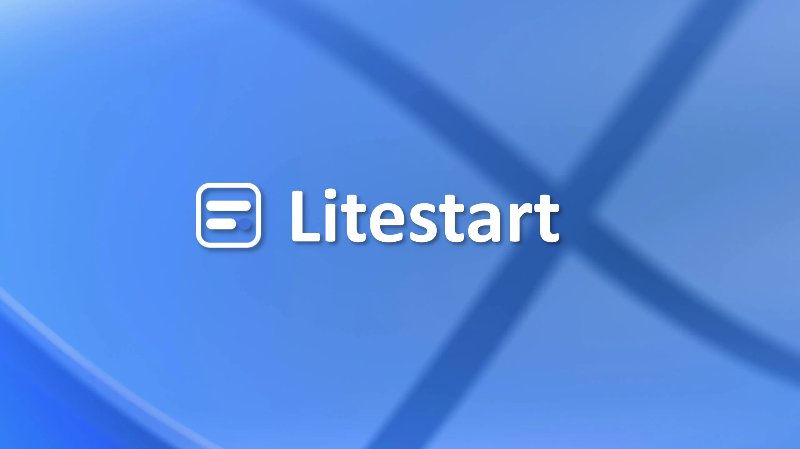
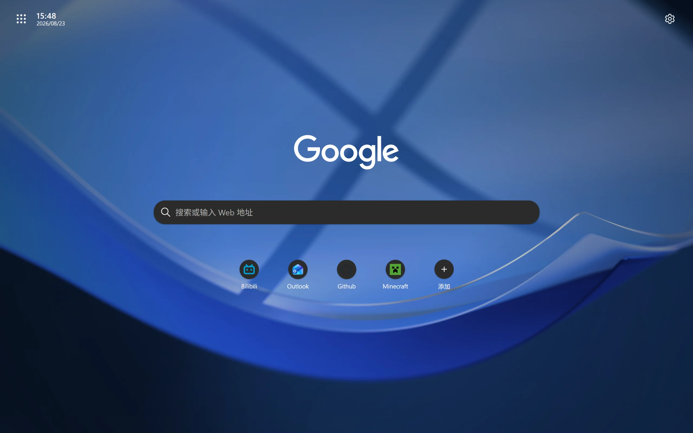
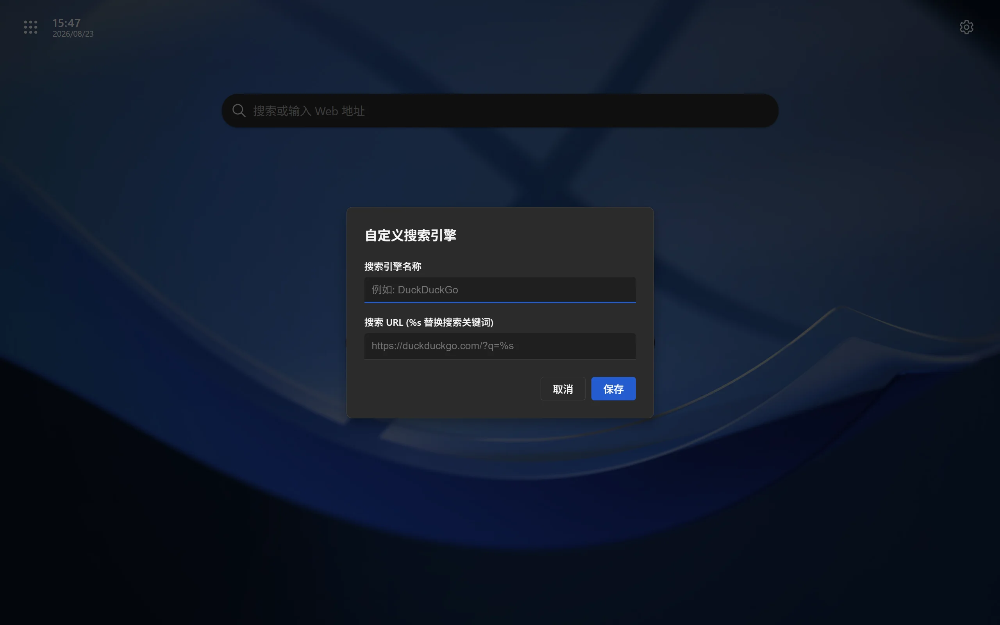
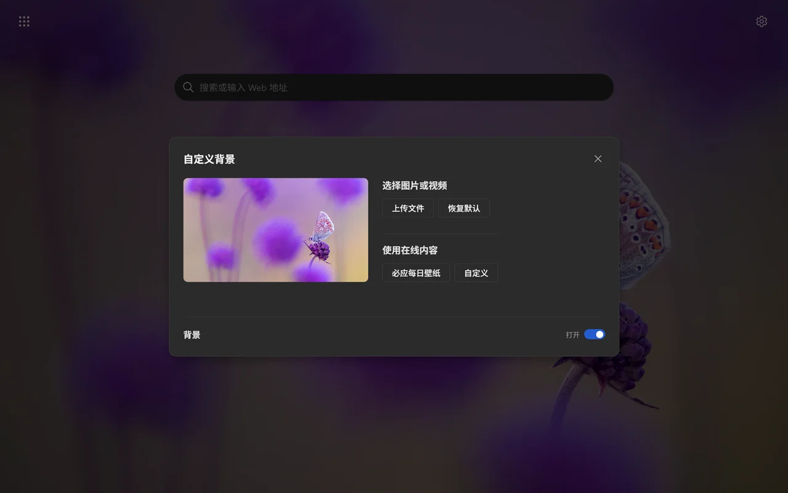

# LitestartCE

<strong>A customizable, Native-like new tab page for desktop browsers · a personalized version of Litestart</strong>

Cutting out the clutter, LitestartCE aims to provide you with a seamless, fast, and lightweight experience.

<a href="README.md">简体中文</a> | [<u>English</u>]

> **LitestartCE = Litestart Customized Edition.**
> This project is a **personalized fork (second-development version)** of [Litestart](https://github.com/XingYueFox/Litestart),
> further developed by [KeepHope2901](https://github.com/yujianxi666) on top of the original by adding more personalization options.
> The original Litestart is developed by [XingYue_Fox](https://xingyuefox.pages.dev) and [AomiRaku](https://raku404.com/),
> and all of the original design and the vast majority of the code come from upstream, under the MIT license.

***

## A more personalized, second-development version of Litestart

LitestartCE keeps the original Litestart's "clean, fast, native-like" character, while adding more customization options:

- 🎨 **Theme mode**: Follow system / Dark / Light, three manually switchable modes;
- 📐 **Layout tuning**: adjustable gaps between elements, position offsets, and element alignment (left edges / center / right edges)
- 🧩 **Element spacing and size tuning**: fine-grained shape and size adjustment for the search box, the engine logo and the quick links
- ★ **Background blur**: adjustable wallpaper blur amount

### Differences from the original

| Item | Litestart (original) | LitestartCE (this fork) |
| --- | --- | --- |
| Theme mode | Follow system only | Follow system / Dark / Light, manually selectable |
| Layout tuning | Fixed gaps and centered | Gaps, horizontal/vertical offsets, alignment, size and shape all adjustable |
| Settings entry | Layout was a standalone modal | Merged into page 2 of the settings panel, sliding left and right for easy preview |
| Update source | XingYueFox/Litestart | yujianxi666/LitestartCE |

> Every other feature of the original (search engines, quick links, search history, custom backgrounds, config import/export, multi-language support, etc.) is fully preserved in LitestartCE and works exactly the same way.

***

## Quick Start

1. Download the latest `.zip` from [Releases](https://github.com/yujianxi666/LitestartCE/releases) (Firefox users should use the `.xpi`), or simply clone this repository
2. Open your browser's extension management page (`chrome://extensions`, `edge://extensions` or `about:debugging`) and enable **Developer Mode**
3. Load the extracted folder via "Load unpacked"
4. Find **LitestartCE** in the extension list and enable it — your new tab page will be replaced with this page

***

## About LitestartCE

- A customizable, native-like browser start page designed for desktop browsers
- In contrast to typical pages, this one contains no extraneous online content, which improves the loading speed of new tabs
- While offering relatively more personalization, it also delivers an ultimate fast experience
- All settings and data are stored locally in your browser

> The screenshots under `docs/pics` come from the original Litestart; the interface is essentially the same as this fork.
> For the newly added items such as theme mode and layout tuning, please refer to the actual page.

## Features

- You can freely switch search engines, and the placement of the logo, site navigation, search history, or even the search box is entirely up to you
- Customize the background, search engine, and layout
- Pin any websites you want to keep on this page
- Or set any video/image wallpaper you like

***

## System & Browser Compatibility

- **OS**: Windows 7+ / macOS 10.15+ / Linux distributions with modern GTK 3 support
- **Browsers**:
  - Chrome/Edge: 109+
  - Firefox: 145+
- **Supported Languages**: Simplified Chinese / Traditional Chinese / English / Русский / 日本語

***

## Important Notice

*LitestartCE is completely free. Please do not obtain this extension from unknown sources, otherwise you bear all the consequences! 
*This fork is a personal customized version; its feature choices and stability are decided by the author's personal usage scenario, **it does not represent the position of the original Litestart**, and no synchronization with upstream is promised. 
*This page/extension is intended for learning, testing, and personal device optimization. 
*Please respect the original authors' work: keep the original attribution and the MIT license when redistributing or modifying.

***

## Credits

- [Litestart](https://github.com/XingYueFox/Litestart) — the upstream original of this project, developed by [XingYue_Fox](https://xingyuefox.pages.dev) and [AomiRaku](https://raku404.com/)
- All [contributors](https://github.com/XingYueFox/Litestart/graphs/contributors) who submitted code, translations and suggestions to the original

## License

MIT License
